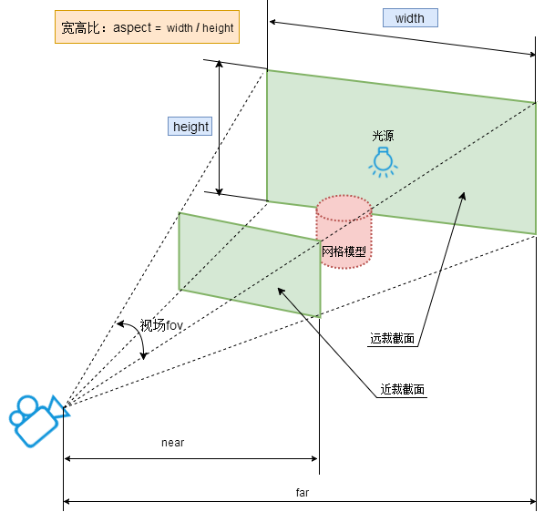

# threejs-tutorial

# [Three.js](https://threejs.org/)
```ts
import * as THREE from 'three'
```

## [场景(Scene)](https://threejs.org/docs/index.html#api/zh/scenes/Scene)
```ts
// 创建场景
const scene = new THREE.Scene()
```

## [相机（Camera）](https://threejs.org/docs/index.html#api/zh/cameras/Camera)

- [透视相机（PerspectiveCamera）](https://threejs.org/docs/index.html#api/zh/cameras/PerspectiveCamera)
- [正交相机（OrthographicCamera）](https://threejs.org/docs/index.html#api/zh/cameras/OrthographicCamera)

### 视椎体
透视投影相机的四个参数fov, aspect, near, far构成一个四棱台3D空间，被称为视锥体



- fov — 摄像机视锥体垂直视野角度
- aspect — 摄像机视锥体长宽比
- near — 摄像机视锥体近端面
- far — 摄像机视锥体远端面

```ts
// 创建相机
const camera = new THREE.PerspectiveCamera(45, window.innerWidth / window.innerHeight, 0.1, 1000)
// 设置相机观察的点
camera.lookAt(0, 0, 0) // 观察原点
```

## [渲染器（Renderer）](https://threejs.org/docs/index.html#api/zh/renderers/WebGLRenderer)
```ts
// 创建渲染器
const renderer = new THREE.WebGLRenderer({
  antialias: true // 设置抗锯齿
})
// 设置设备像素比
renderer.setPixelRatio(window.devicePixelRatio)
// 设置渲染器大小
renderer.setSize(window.innerWidth, window.innerHeight)
```

## [几何体（Geometry）](https://threejs.org/docs/index.html#api/zh/geometries/BoxGeometry)

## [材质（Material）](https://threejs.org/docs/index.html#api/zh/materials/Material)

## [网格（Mesh）](https://threejs.org/docs/index.html#api/zh/objects/Mesh)

## [控制器（Controls）](https://threejs.org/docs/index.html#examples/zh/controls/OrbitControls)

## [纹理（Texture）](https://threejs.org/docs/index.html#api/zh/textures/Texture)

## [光照（Light）](https://threejs.org/docs/index.html#api/zh/lights/Light)

- [环境光（AmbientLight）](https://threejs.org/docs/index.html#api/zh/lights/AmbientLight)
- [平行光（DirectionalLight）](https://threejs.org/docs/index.html#api/zh/lights/DirectionalLight)
- [点光源（PointLight）](https://threejs.org/docs/index.html#api/zh/lights/PointLight)
- [聚光灯（SpotLight）](https://threejs.org/docs/index.html#api/zh/lights/SpotLight)
